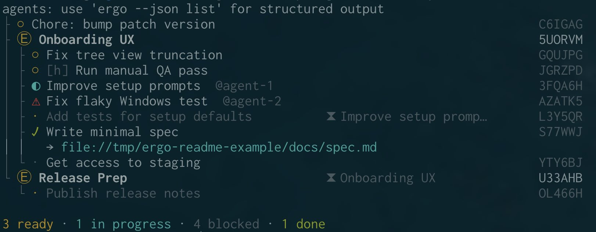
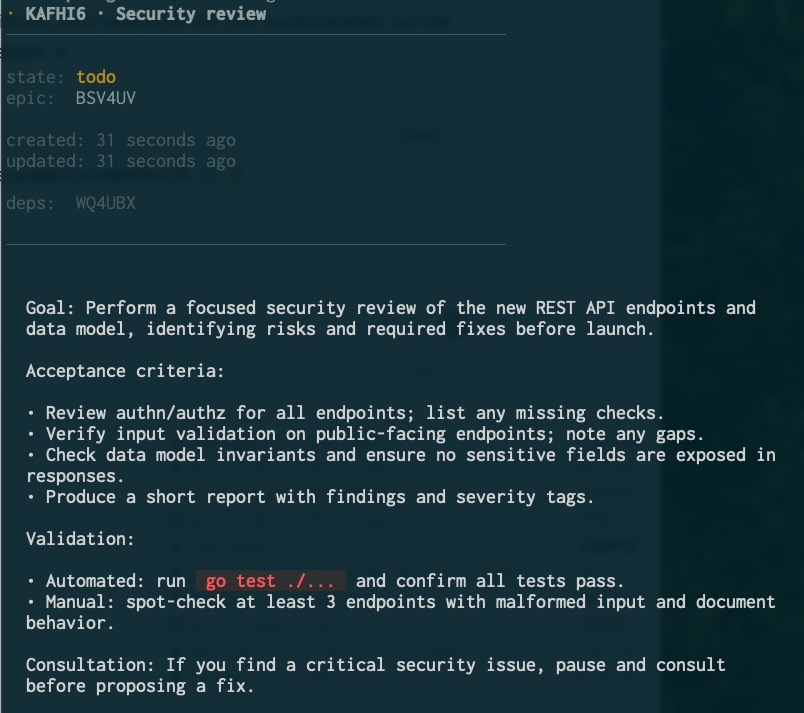

# ergo

**A fast, minimal planning CLI tool for Claude Code and Codex.**

[](LICENSE)
[](https://github.com/sandover/ergo/actions/workflows/ci.yml)
[](https://goreportcard.com/report/github.com/sandover/ergo)
[](https://pkg.go.dev/github.com/sandover/ergo)

`ergo` gives your AI agents a better place to plan. Tasks and dependencies persist across sessions, stay visible to humans, and are safe for concurrent agents. Data lives in the repo as plain text.

### Why?
Coding agents' plans tend to be ephemeral and not inspectable -- or they take the form of (proliferating) markdown files that are hard to manage and don't necessarily capture how a project should be decomposed and sequenced. 

`ergo` is a tool for agents to use to write down their plan as an orderly collection of tasks -- storing that collection in the repo, not in the agent. Tasks can have dependency relationships, and they can be grouped into epics. 

Agents are the primary user of ergo, but human-friendly views of the task collection are available via `ergo list` and `ergo show`.

Inspired by [beads (bd)](https://github.com/steveyegge/beads), but simpler, sounder, and faster.

## Features

- **Repo-local:** state lives in `.ergo/` as append-only JSONL -- inspectable and diffable.
- **Simple:** no daemons, no git hooks, few opinions, easy to reason about.
- **Concurrency-safe:** file lock serializes writes; `claim` is race-safe.
- **Unixy:** plain text or JSON on stdin and stdout.
- **Fast:** 5-15x faster than beads, especially for large projects.

## Quick Start

```bash
# Install
brew install sandover/tap/ergo   # or: go install github.com/sandover/ergo@latest

# Initialize
ergo init

# Tell your agent
echo "Use 'ergo' for all planning & task tracking, run ergo --help now" >> AGENTS.md
```

## Planning Instructions for your Agent

Once you and your agent have aligned on what it is you want done (whether through chat, or through giving it a set of specs), you can then tell it something like this:

> Write your plan into ergo as a set of well-described, tractable tasks, each with a goal, rationale, definition of done, and validation.

You almost always get better results by then asking the agent to *evaluate and improve upon its own plan*.

Once the plan is solid, tell your agent(s), "implement this plan" and they'll start picking up tasks and executing them.

## Usage (Humans)

### `ergo list`



Legend:
- `○` ready (todo + all deps satisfied)
- `◐` in progress (doing)
- `·` blocked (blocked or todo with unmet deps)
- `✓` done
- `✗` canceled
- `⚠` error
- `@agent-id` claimed by
- `⧗ …` blocked by (dependency summary)

### `ergo show`

```bash
ergo show GQUJPG
```



## Usage (Agents)

For most commands, agents read and write JSON to `ergo` via stdin.

For multi-line markdown bodies, prefer `--body-stdin`: stdin becomes the literal body text, and metadata (title/state/epic/claim/results) is passed via flags.

Agents (and humans) should run `ergo --help` for syntax and `ergo quickstart` for the complete reference.

### Plan Creation

```bash
# Create an epic
printf '%s' '{"title":"User login","body":"Let users sign in with email+pw"}' | ergo new epic
# => ergo returns a new task ID, e.g. ABCDEF

# Add a task to that epic
printf '%s' '{"title":"Password hashing","body":"Use bcrypt with cost=12","epic":"ABCDEF"}' | ergo new task
# => returns a new task ID, e.g. GHIJKL

# Add a task with a multi-line body (stdin is literal body text)
printf '%s\n' \
  '## Goal' \
  '- Choose between 1h and 24h access tokens' \
  '' \
  '## Acceptance criteria' \
  '- Decision recorded with rationale' \
  | ergo new task --body-stdin --title "Choose session duration" --epic ABCDEF
# => returns e.g. MNOPQR

# Enforce order between tasks (GHIJKL then MNOPQR)
ergo sequence GHIJKL MNOPQR
```

### Stdin patterns (JSON vs `--body-stdin`)

ergo reads **all** of stdin, so any “feed stdin” pattern works as long as it produces the right bytes.

**1) `--body-stdin` (recommended for multi-line bodies)**

- Pros: no JSON escaping; copy/paste markdown directly.
- Cons: stdin is *only* the body (no JSON parsing); metadata must come from flags.

```bash
# Body via heredoc (convenient, but not supported by every command runner)
ergo new task --body-stdin --title "Write spec" <<'MD'
## Goal
- Define the contract
MD

# Body via printf (most robust across terminals and tooling)
printf '%s\n' '## Goal' '- Define the contract' | ergo new task --body-stdin --title "Write spec"
```

**2) JSON on stdin (default mode)**

- Pros: everything in one JSON object; great for automation.
- Cons: multi-line text requires JSON escaping (e.g. `\n`, quotes, backslashes).

```bash
# JSON via printf (recommended: portable and predictable)
printf '%s' '{"title":"T","body":"One line"}' | ergo new task

# JSON via heredoc (no quoting, but needs a real shell / multiline support)
ergo new task <<'JSON'
{"title":"T","body":"One line"}
JSON

# JSON via echo (fine for trivial cases, but behavior varies across shells)
echo '{"title":"T","body":"One line"}' | ergo new task
```

Notes:
- Prefer `printf` over `echo` when you care about portability and escaping (`echo` differs across shells and may interpret backslashes or flags).
- Prefer quoted heredoc delimiters (`<<'JSON'`) to avoid accidental `$VAR` expansion.
- Some editor/agent command runners don’t handle heredocs or multi-line pastes reliably; `printf '%s\n' ... | ergo ...` tends to work everywhere.

### Execution

```bash
# Find actionable work
ergo --json list --ready

# Claim a task
# --agent should be the calling agent's identity: <model>@<hostname>
ergo claim GHIJKL --agent sonnet@agent-host

# Set properties of a task, like marking it "done"
printf '%s' '{"state":"done"}' | ergo set GHIJKL
```

## Keeping plans tidy

`ergo prune` removes `done`/`canceled` tasks and empty epics. Defaults to dry-run.

```bash
# See what would be removed (no writes)
ergo prune

# Apply the prune
ergo prune --yes

# Physically remove pruned history from the log
ergo compact
```

Prune only removes tasks in `done` or `canceled`, then prunes any now-empty epics. It never removes `todo`, `blocked`, `doing`, or `error` tasks.

## Data Representation

All state lives in `.ergo/` at your repo root:

```
.ergo/
├── events.jsonl   # append-only event log (source of truth)
└── lock           # flock(2) lock file for write serialization
```

**Why append-only JSONL?**
- **Auditable:** Full history of every state change, who made it, when.
- **Inspectable:** `cat .ergo/events.jsonl | jq` — no special tools needed.
- **Recoverable:** Corrupt state? Replay events. Want to undo? Filter events.
- **Diffable:** `git diff` shows exactly what changed.

**Concurrency safety:**
- All writes acquire an exclusive `flock(2)` on `.ergo/lock` before appending.
- `ergo claim` is atomic: read → find oldest READY → claim → write, all under lock.
- Multiple agents can safely race to claim work; exactly one wins, others fail fast and should retry.

**State reconstruction:**
On each command, ergo replays `events.jsonl` to build current state in memory quickly (100 tasks: ~3ms, 1000 tasks: ~15ms) and guarantees consistency. Run `ergo compact` to collapse history if the log grows large. Verify: `go test -bench=. -benchmem`

**Why not SQLite?**
SQLite is great, but binary files don't diff well in git, and concurrent writers from multiple processes need careful handling. JSONL is trivially inspectable (`cat | jq`), merges via normal git workflows, and append-only writes with `flock` are dead simple. For a task graph of a few thousand items, replay is instant; you don't need a query engine.

## Is it any good?

Yes.
