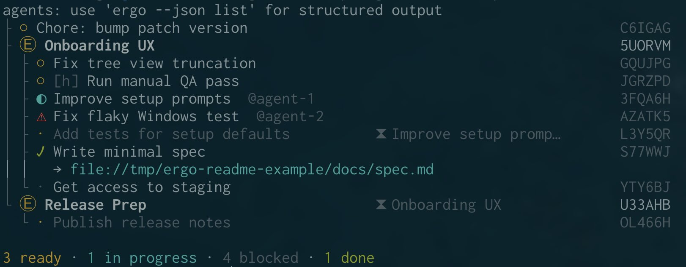

# ergo

**A fast, minimal planning CLI for coding agents.**

[](LICENSE)
[](https://github.com/sandover/ergo/actions/workflows/ci.yml)
[](https://goreportcard.com/report/github.com/sandover/ergo)
[](https://pkg.go.dev/github.com/sandover/ergo)

Ergo stores task graphs in the repository as compact, git-friendly JSONL. Plans
survive agent sessions, remain visible to humans, and work across agent harnesses.

Coding agents often blur a product specification and an implementation backlog.
Ergo gives the backlog a small, durable home. Agents create tasks, add dependency
order, claim ready work, and finish through direct commands. A file lock makes
concurrent claims and mutations safe.

Inspired by [beads (bd)](https://github.com/steveyegge/beads), with a smaller
command and storage model.

## Install

macOS with Homebrew:

```sh
brew install sandover/tap/ergo
```

Any supported platform with Go:

```sh
go install github.com/sandover/ergo/cmd/ergo@latest
```

Add a short repository instruction for your coding agent:

> Use Ergo for feature planning. Run `ergo --help` and `ergo quickstart` to learn it.

The repository also ships a deeper planning skill at
[`skills/ergo-feature-planning/SKILL.md`](skills/ergo-feature-planning/SKILL.md).

## Plan work

Create a container and child tasks from markdown:

```sh
cat > tasks.md <<'EOF'
# Password hashing
Use bcrypt with cost 12.
---
# Session tokens
Use 1-hour access and 24-hour refresh tokens.
EOF

ergo --json plan --file tasks.md '{"title":"User login"}'
```

File order does not create dependencies. Add order explicitly:

```sh
ergo sequence TASK_HASHING TASK_TOKENS
```

Create work incrementally when that is clearer:

```sh
ergo new task '{"title":"User login"}'
# => OFKSTE

printf '%s\n' 'Use bcrypt with cost 12.' |
  ergo new task '{"title":"Password hashing","epic":"OFKSTE"}'
```

## Execute work

```sh
# Inspect actionable work.
ergo --json list --ready

# Claim the oldest ready task.
ergo --json claim --agent sonnet@hostname

# Or resume a specific task by ID.
ergo --json claim ABCDEF --agent sonnet@hostname

# Leave the claim through one direct intent.
ergo done ABCDEF --result src/auth.go
ergo block ABCDEF
ergo cancel ABCDEF
ergo release ABCDEF
```

Claim JSON returns the exact task-specific commands for all four exits. A claim
exists exactly while state is `doing`. Done, block, cancel, and release clear it.

Use release for unfinished work that remains valid. Use block when an identified
impediment must be resolved before another attempt.

## Human views

```sh
ergo list
ergo show ABCDEF
ergo prune
```



The primary list symbols are:

- `○` ready todo work
- `◐` doing work and its agent identity
- `·` explicit blocked work or todo work waiting on dependencies
- `✓` done
- `✗` canceled
- `⚠` unresolved legacy error
- `⧗` dependency summary

Prune previews closed work by default. `ergo prune --yes` records tombstones.
`ergo compact` later removes pruned history and collapses the live log.

## Edit tasks

```sh
ergo title ABCDEF "Clarify authentication failure"
printf '%s\n' '## Goal' '- Clarify the failure' | ergo body ABCDEF
ergo move ABCDEF OFKSTE
ergo move ABCDEF --root
```

Lifecycle commands also accept a piped body and `--result` in one atomic update:

```sh
printf '%s\n' '## Completion' '- Implemented and verified.' |
  ergo done ABCDEF --result docs/verification.md
```

## V2 command cutover

V2 replaces generic field and state mutation with direct verbs:

| V1 intent | V2 command |
| --- | --- |
| Claim or set doing | `claim` |
| Mark complete | `done` |
| Record an impediment | `block` |
| Stop unwanted work | `cancel` |
| Return unfinished work to todo | `release` |
| Rename | `title` |
| Replace body | `body` |
| Change container | `move` |

Resume done or canceled work with a specific claim. V2 deliberately has no
operation that returns closed work to unclaimed todo. The historical error state
remains readable but cannot be created. Use release for a retryable attempt or
block for an impediment.

Existing repositories require no migration. Ergo reads both `plans.jsonl` and
the legacy `events.jsonl` filename, preserves unresolved legacy state during
compact, and normalizes it only after an explicit lifecycle command.

## Storage

```text
.ergo/
├── plans.jsonl    # append-only event log
└── lock           # write and coherent-read serialization
```

Plain JSONL is inspectable, diffable, and recoverable. Each command replays the
log into memory. Mutations validate and append their complete event batch under
the lock. Oldest-ready claim selects and writes under that same lock, so
concurrent agents cannot claim the same task.

Run `ergo --help` for the compact reference and `ergo quickstart` for every
command, flag, input rule, JSON guarantee, and legacy behavior.
