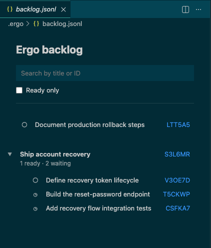

# ergo

**A shared task list for you and your coding agents.**

[](LICENSE)
[](https://github.com/sandover/ergo/actions/workflows/ci.yml)
[](https://goreportcard.com/report/github.com/sandover/ergo/v6)
[](https://pkg.go.dev/github.com/sandover/ergo/v6)

The `ergo` CLI is a way for coding agents to keep implementation plans, progress, and results inside your project -- outside the agent harness. This way, your backlog is independent of any one agent, model, session, or machine. A backlog should be interruptible, resumable, storable, parallelizable, and legible, and with `ergo`, that's how it is.

Have your agent write out its plans using `ergo` instead of Markdown files or an internal plan tool. You can opt to track the backlog in git or keep it local.

- Tasks have state (like "todo" or "doing" or "done")
- Tasks can depend on one another, so the “Build the signup endpoint” task can wait for the “Create the database tables” task.
- Tasks can be grouped into epics.

Your agent writes the backlog, but it's easy for you to read and review it. Run `ergo list`:


## Install

macOS with Homebrew:

```sh
brew install sandover/tap/ergo
```

Windows with WinGet:

```powershell
winget install --id Sandover.Ergo --exact
```

If WinGet does not find Ergo yet, download the Windows archive from the
[latest GitHub release](https://github.com/sandover/ergo/releases/latest),
extract `ergo.exe`, and add its directory to your user `PATH`. Open a new
terminal after changing `PATH`.

Any supported platform with Go:

```sh
go install github.com/sandover/ergo/v6/cmd/ergo@latest
```

Prebuilt archives for macOS, Linux, and Windows are also available from the
[latest GitHub release](https://github.com/sandover/ergo/releases/latest).

## Try it

In your project's directory, run:

```sh
ergo init
```

Add this to your `AGENTS.md`:

> Use Ergo to manage the implementation backlog. Run `ergo --help` and
> `ergo quickstart` to learn it.

Then ask your agent:

> Plan the password-reset feature in Ergo.

Review the plan with `ergo list` and use `ergo show <id>` to read a task's
details. When you're ready, tell the agent:

> Implement the plan

In any new session, just tell your agent to read the Ergo backlog and continue the work.

## View in VS Code

Install the [Ergo Backlog](https://marketplace.visualstudio.com/items?itemName=sandover.ergo-backlog)
extension and open `.ergo/backlog.jsonl` to browse tasks and their details.



## Your backlog stays with your code

Ergo is a small command-line tool with no database or background service to
manage. It stores the backlog in `.ergo/backlog.jsonl` and task history,
including notes and results, in `.ergo/journal.jsonl`. Track these plain-text
files in Git, or add them to `.gitignore` for local use.

## Learn more

The manual lives in the CLI: `ergo --help` gives the overview, `ergo quickstart`
gives the complete guide, and `ergo <command> --help` explains each command.
You can also read the [overview](internal/ergo/help.txt) and
[guide](internal/ergo/quickstart.txt) here before installing.

The optional [backlog-planning skill](skills/ergo-backlog-planning/SKILL.md)
helps agents write well-structured tasks.

`ergo` is inspired by [Beads](https://github.com/gastownhall/beads), but has a focus on simplicity and speed.
