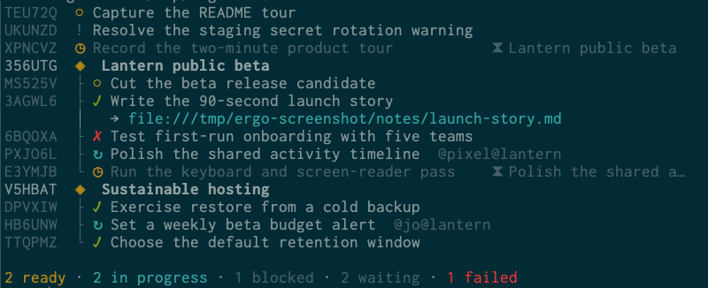
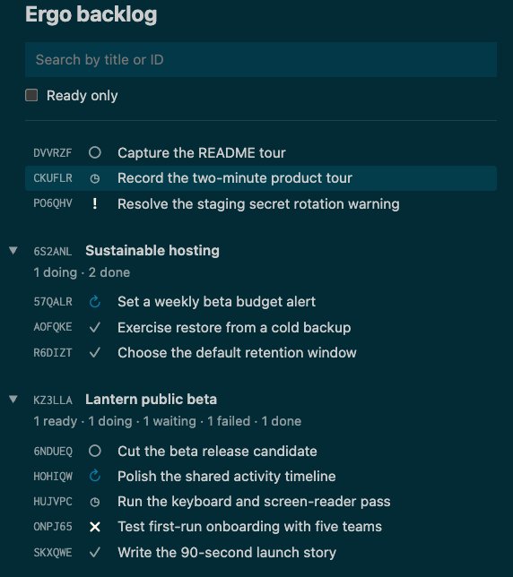

# ergo

**A fast, minimal, dependency-aware backlog for coding agents.**

[](LICENSE)
[](https://github.com/sandover/ergo/actions/workflows/ci.yml)
[](https://goreportcard.com/report/github.com/sandover/ergo/v4)
[](https://pkg.go.dev/github.com/sandover/ergo/v4)

You (and your agent) use Ergo to manage an implementation backlog in your repo.  You have the agent write plans to ergo, instead of to markdown files or the plan mode inside of agent harnesses. 

Why do this? 

Because it turns your work backlog into something readable, storable, interruptible, resumable, shareable, portable, and rewindable. And you can track the whole thing in git. It's just a couple of JSONL files.

ergo is just a CLI. 

So, instead of plan mode, agents use the ergo CLI to create tasks, order them with dependencies, claim them, and report results. Multiple agents can be working in parallel -- ergo is built for this.

We humans can also use the ergo CLI to view or update the backlog. Plus there's a VS Code plugin. 

Ergo is deliberately small and sound. The backlog and its shared task journal are plain, git-friendly JSONL stored in a `.ergo/` directory in your repo, which you can track with git or add to `.gitignore`.

Ergo is inspired by [beads (bd)](https://github.com/steveyegge/beads), but built for simplicity and speed. 

## Install

macOS with Homebrew:

```sh
brew install sandover/tap/ergo
```

Any supported platform with Go:

```sh
go install github.com/sandover/ergo/v4/cmd/ergo@latest
```

Prebuilt archives for macOS, Linux, and Windows are available from the
[latest GitHub release](https://github.com/sandover/ergo/releases/latest).

Add a short repository instruction for your coding agent:

> Use Ergo to manage the implementation backlog. Run `ergo --help` and
> `ergo quickstart` to learn it.

That's it!

The repository also ships an [Ergo backlog-planning skill](skills/ergo-backlog-planning/SKILL.md).

## Seeing your backlog

Once your agent has written out a backlog, you can view it with `ergo list`



or in VS Code with the [Ergo Backlog](https://marketplace.visualstudio.com/items?itemName=sandover.ergo-backlog) plugin available in the VS Code Extension Marketplace. If you click on `.ergo/backlog.jsonl` you'll see something like this:



## Tasks and epics

- **Tasks** can be in draft, todo, doing, blocked, done, failed, or canceled.

- **Epics** don't have their own state. An epic finishes when all its children
  finish, and its outcome reflects their outcomes.

- Tasks can depend on other tasks, including across epic boundaries.

## Journal

- Ergo keeps task history in `.ergo/journal.jsonl`. 

- The journal records task creation, state changes, notes, and results from
  agents. 

- Agents can use `ergo result` to record what they changed, how they verified
  it, or where they left supporting evidence.

- You can track the journal in git with the backlog, or add it to `.gitignore`
  if you don't want to keep the work history.

## Learn more

The manual lives in the CLI. `ergo --help` gives you the overview, `ergo
quickstart` gives you the complete guide, and every command has its own help.
