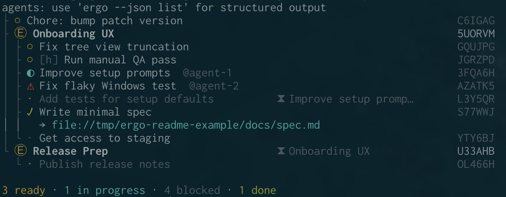

# ergo

**A fast, minimal, dependency-aware backlog for coding agents.**

[](LICENSE)
[](https://github.com/sandover/ergo/actions/workflows/ci.yml)
[](https://goreportcard.com/report/github.com/sandover/ergo)
[](https://pkg.go.dev/github.com/sandover/ergo)

Ergo keeps an implementation backlog in the repository. Agents create tasks,
order them with dependencies, claim ready work, and record outcomes through
direct commands. Humans see the same backlog. A repository lock keeps concurrent
claims and mutations safe.

Ergo is deliberately small: tasks, epics, dependencies, lifecycle state, and
results. Its append-only event log is plain, git-friendly JSONL.

Inspired by [beads (bd)](https://github.com/steveyegge/beads), with a smaller
command and storage model.

## Install

macOS with Homebrew:

```sh
brew install sandover/tap/ergo
```

Any supported platform with Go:

```sh
go install github.com/sandover/ergo/cmd/ergo@latest
```

Add a short repository instruction for your coding agent:

> Use Ergo to manage the implementation backlog. Run `ergo --help` and
> `ergo quickstart` to learn it.

The repository also ships an
[Ergo feature-planning skill](skills/ergo-feature-planning/SKILL.md) for shaping
and executing larger backlogs.

## Start

```sh
ergo init
ergo new task "Add login"
# => ABCDEF

ergo list --ready
ergo claim ABCDEF --agent model@host
ergo done ABCDEF -m "Implemented and verified"
```

Use a concise title. Pipe longer context into the initial body:

```sh
printf '%s\n' 'Use bcrypt with cost 12.' |
  ergo new task "Add password hashing"
```

## Create an epic

An epic is a root task with children. Create one from a Markdown file:

```sh
cat > tasks.md <<'EOF'
# Password hashing
Use bcrypt with cost 12.
---
# Session tokens
Use 1-hour access and 24-hour refresh tokens.
EOF

ergo new epic "User login" --file tasks.md
```

Each `# Title` chunk becomes a child task. File order does not create
dependencies. Add order explicitly:

```sh
ergo sequence TASK_HASHING TASK_TOKENS
```

Optional piped stdin becomes free-form context on the epic.

You can also build an epic incrementally:

```sh
EPIC_ID=$(ergo new task "User login")
ergo new task "Password hashing" --epic "$EPIC_ID"
```

The first child promotes a clean root todo task to an epic.

## Work with the backlog

```sh
ergo list
ergo list --ready
ergo list --epic ABCDEF
ergo show ABCDEF
```



Claim a known task or the oldest ready task:

```sh
ergo claim ABCDEF --agent model@host
ergo claim --agent model@host
```

Finish the attempt with the command that states the outcome:

```sh
ergo done ABCDEF -m "Implemented and verified" --result docs/verification.md
ergo block ABCDEF -m "Waiting for the staging credential"
ergo cancel ABCDEF -m "Requirement withdrawn"
ergo release ABCDEF -m "Ready for another agent"
```

Lifecycle messages append. Results refer to existing project-relative files.
Lifecycle commands clear the claim and never replace the task body.

Use focused commands to edit existing work:

```sh
ergo title ABCDEF "Clarify authentication failure"
printf '%s\n' '## Goal' '- Clarify the failure' | ergo body ABCDEF
ergo move ABCDEF GHIJKL
ergo move ABCDEF --root
```

## Storage

```text
.ergo/
├── backlog.jsonl  # append-only event log
└── lock           # write and coherent-read serialization
```

Each command replays the event log into memory. Mutations validate and append
their complete event batch under the lock. Ready-task selection and claim happen
under that same lock, so concurrent agents cannot claim the same task.

Run `ergo --help` for the front door, `ergo <command> --help` for one command,
and `ergo quickstart` for the complete guide.
